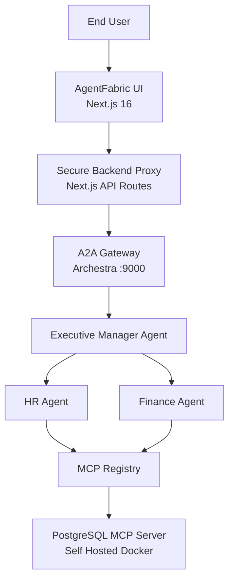
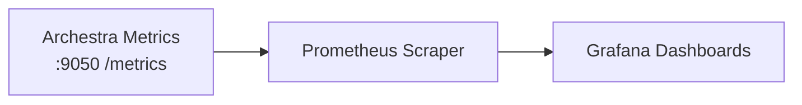
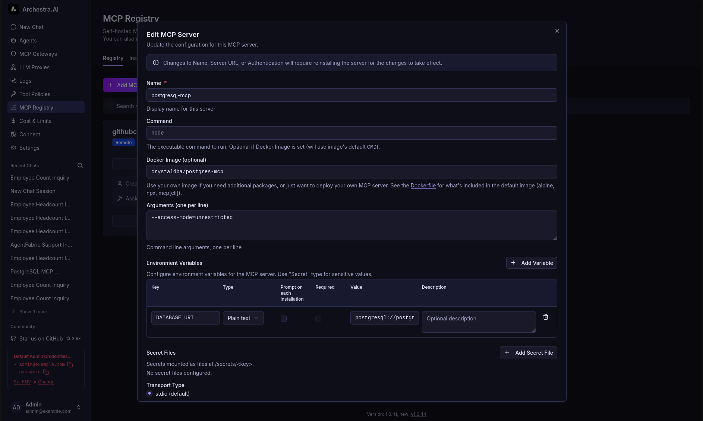

# 🧵 AgentFabric — Enterprise AI Workforce Control Plane

> **Built for the [2 Fast 2 MCP Hackathon](https://www.wemakedevs.org/hackathons/2fast2mcp)**
> Powered by [Archestra.ai](https://www.archestra.ai)

---

# 🚀 What Is AgentFabric?

**AgentFabric is a governed, observable, multi-agent AI workforce platform.**

It simulates a real enterprise where departments operate as intelligent AI agents — securely orchestrated through Archestra and connected to live data via MCP.

This is not a chatbot demo.
This is enterprise AI infrastructure.

---

# 📑 Table of Contents

- [🏗️ Visual Architecture](#️-visual-architecture-mermaid)
- [🏢 AI Workforce Model](#-ai-workforce-model)
- [🔐 Enterprise Governance Capabilities](#-enterprise-governance-capabilities-used)
- [📊 Observability Dashboard](#-production-observability-dashboard)
- [📸 Screenshots](#-screenshots-add-your-images-here)
- [🛠 Tech Stack](#-tech-stack)
- [🚀 Quick Start](#-quick-start)
- [📚 What I Learned](#-what-i-learned-building-agentfabric-with-archestraai)
- [🧵 Final Philosophy](#-final-philosophy)

---

# 🏗️ Visual Architecture

## 🔷 Core System Architecture



---

## 📊 Observability Architecture



---

# 🏢 AI Workforce Model

| Agent | Responsibility | Capabilities |
| -------------------- | ----------------------- | ------------------------------- |
| 🧠 Executive Manager | Orchestrates sub-agents | Delegation, strategic summaries |
| 👥 HR Agent | Employee intelligence | Leave data, org structure |
| 💰 Finance Agent | Financial analytics | Budgets, expenses, payroll |

Each agent:

* Runs remotely on Archestra
* Uses controlled MCP tools
* Operates under policy enforcement
* Is fully observable via metrics

---

# 🔐 Enterprise Governance Capabilities Used

AgentFabric deeply integrates Archestra’s core platform features:

## ✅ MCP Registry

* Remote MCP services
* Self-hosted PostgreSQL MCP (Docker)
* Fine-grained tool assignment per agent
* Credential isolation per MCP service

## ✅ LLM Configuration

* Centralized model provider management
* No API keys exposed to frontend
* Provider abstraction without code changes

## ✅ Tool Policies

* Context-aware allow/block rules
* Trusted vs untrusted result classification
* Optional dual-LLM sanitization
* Tool execution governance

## ✅ A2A Gateway

* Token-based secure agent communication
* Standardized agent interoperability
* Zero direct LLM calls from client

## ✅ Archestra Platform APIs

* Agent card discovery
* Conversation history retrieval
* Dynamic agent metadata loading

## ✅ Observability

* Token usage metrics
* Cost tracking
* P95 latency
* Time to first token
* Blocked tool counts
* CPU and system health

---

# 📊 Production Observability Dashboard

AgentFabric integrates Prometheus + Grafana to monitor:

* 🔢 Total Tokens Used
* 👤 Tokens Per Agent
* 📥 Input vs Output Split
* 💰 Cost Per Agent
* ⚡ Tokens Per Second
* ⏱ P95 Request Latency
* 🚨 Blocked Tool Attempts

This transforms AI from a black box into a measurable enterprise system.

---


# 📸 Screenshots (Add Your Images Here)

## 🖥️ Workforce Control Plane UI


---

## 💬 Agent Conversation View


---

## 📊 Observability Dashboard


---

## 🔧 MCP Configuration



---

# 🛠 Tech Stack

| Layer | Technology |
| ------------- | --------------------- |
| Frontend | Next.js 16 + React 19 |
| Backend | Next.js API Routes |
| Protocol | A2A + MCP |
| AI Platform | Archestra |
| Database | PostgreSQL |
| Observability | Prometheus + Grafana |
| SDK | @a2a-js/sdk |

---

# 🚀 Quick Start

```bash
git clone https://github.com/TheKumaara/AgentFabric.git
cd agentfabric
npm install
```

### Setup Database

```bash
createdb agentfabric
npm run db:push
npm run db:seed
```

### Configure Archestra

```
ARCHESTRA_API_KEY=
ARCHESTRA_A2A_GATEWAY_TOKEN=
ARCHESTRA_BASE_URL=
ORCHESTRATOR_PROMPT_ID=
HR_PROMPT_ID=
FINANCE_PROMPT_ID=
```

```bash
npm run dev
```

---

# 📚 What I Learned Building AgentFabric with Archestra.ai

Building this AI Workforce platform using Archestra was not just about creating agents — it was about understanding how to design **secure, governed, observable multi-agent systems** for real-world use.

Here are the key learnings from this journey:

---

## 🧠 1. Designing with Agent-to-Agent (A2A) Protocol

This project was my first real implementation of the **Agent 2 Agent (A2A) protocol**.

I learned how to:

* Connect agents through the A2A Gateway
* Build hierarchical delegation (Executive → HR → Finance)
* Treat agents as composable services rather than isolated chatbots
* Enable structured communication between agents

> **Key Insight:** *Agents are not just conversational interfaces — they are orchestrated, protocol-driven services capable of delegation and collaboration.*

---

## 🔐 2. Securing LLM Access Through Platform Abstraction

Using Archestra’s LLM configuration layer, I learned:

* Why API keys should never be exposed in application code
* How centralized LLM configuration improves security
* How to swap providers or models without modifying business logic

> **Key Insight:** *Production AI systems must separate application logic from LLM credentials and provider configuration.*

---

## 🧰 3. Fine-Grained MCP Tool Governance

Through the MCP Registry, I learned how to:

* Manage both remote and self-hosted MCP servers
* Attach specific tools to specific agents
* Restrict tool access based on business requirements
* Assign separate credentials for team-level or service-level usage

> **Key Insight:** *Tools are the real power of agents — but without governance, they become risk. Archestra enables precise, business-aligned tool control.*

---

## 🛡 4. Implementing Tool Policies & LLM Safety Controls

I explored Archestra’s tool policy capabilities to:

* Allow or block tool calls based on context
* Mark tool outputs as trusted or untrusted
* Sanitize tool results via chained LLM calls
* Prevent malicious data from propagating into primary LLM prompts

> **Key Insight:** *AI systems must treat tool outputs as potentially unsafe input. Governance and validation layers are essential for secure AI operations.*

---

## 📊 5. Production-Grade AI Observability

Using the metrics exposed at port `9050`, I integrated:

* Prometheus for metric collection
* Grafana for visualization
* Real-time dashboards tracking:

  * Total token usage
  * Input vs output token split
  * Cost per agent
  * P95 latency
  * Streaming performance
  * Blocked tool attempts

> **Key Insight:** *AI systems need the same observability standards as distributed systems. Tracking cost, latency, usage, and governance metrics transforms AI from a demo into a production-ready platform.*

---

## 🏗 6. Thinking in Enterprise Architecture

This project shifted my mindset from building prompt-based features to designing **platform-level AI systems**:

* Separation of orchestration from application logic
* Centralized LLM and tool governance
* Role-based agent delegation
* Observability-driven performance monitoring
* Infrastructure-aware AI design

> **Key Insight:** *Enterprise AI requires orchestration, governance, and observability — not just intelligence.*

---

## 🚀 Holistic Growth

Building AgentFabric with Archestra.ai taught me that:

* Multi-agent systems require protocol-driven architecture
* Governance is as important as capability
* Observability makes AI measurable and controllable
* Secure tool access is foundational to real-world deployment
* Platform-first design enables scalable AI workforce systems

This project marked a transition from experimenting with LLMs to engineering structured, secure, and production-oriented AI systems.

---

# 🧵 Final Philosophy

> AgentFabric is not an AI chatbot.
> It is an enterprise AI workforce infrastructure layer.

---
