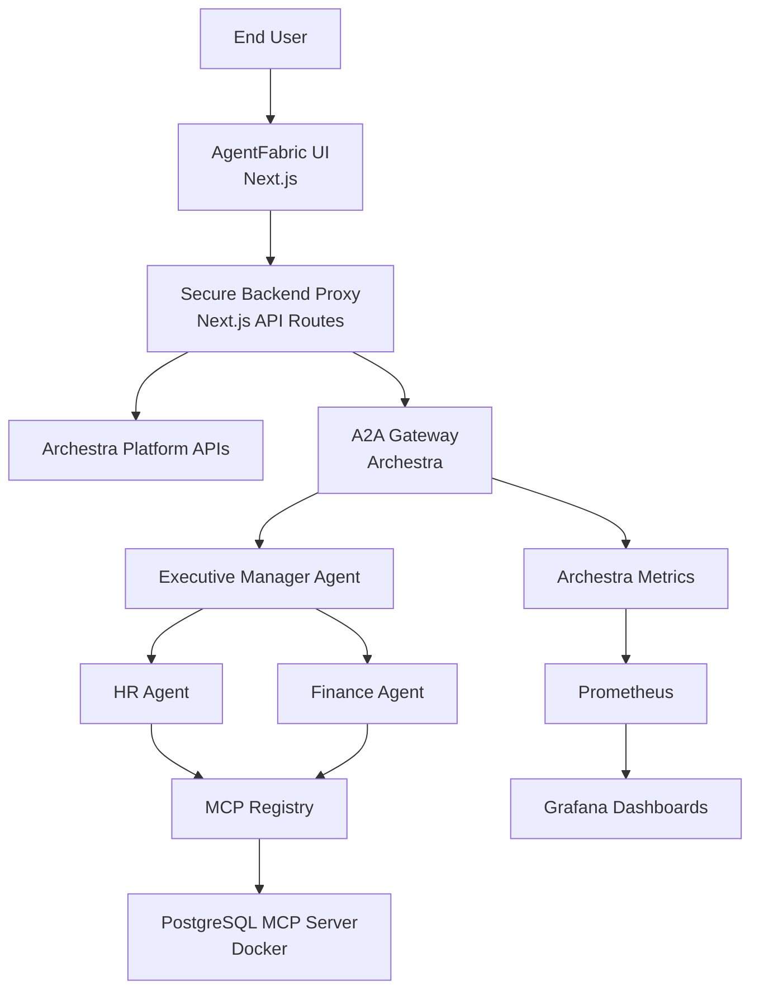
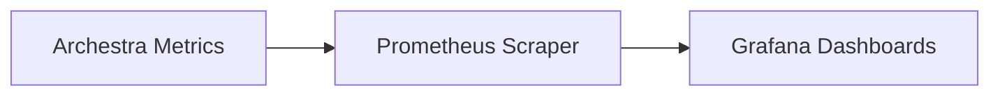
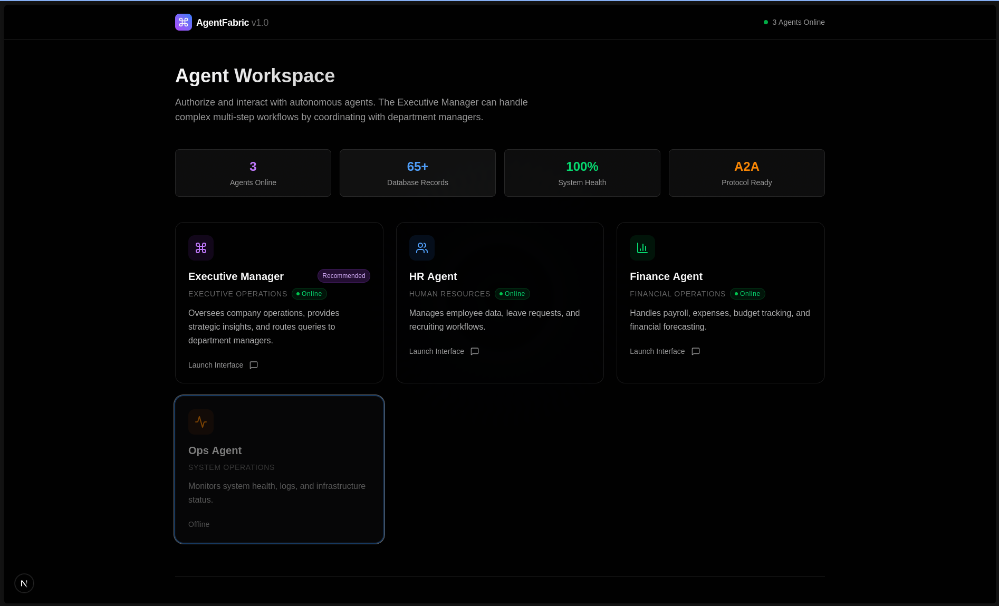
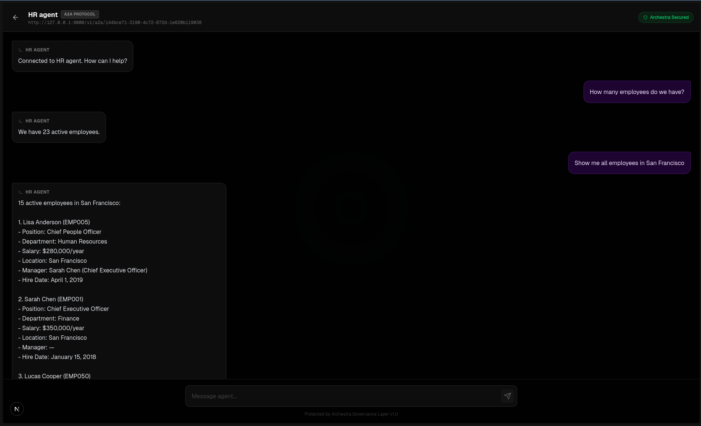
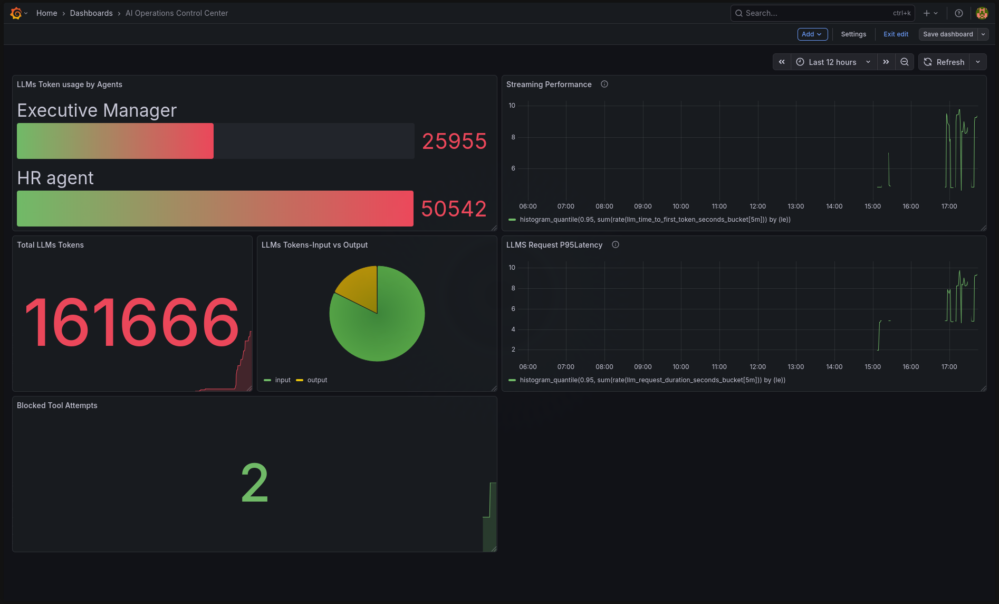

# 🧵 AgentFabric — Enterprise AI Workforce Control Plane

> **Built for the [2 Fast 2 MCP Hackathon](https://www.wemakedevs.org/hackathons/2fast2mcp)**
> Powered by [Archestra.ai](https://www.archestra.ai)

---

# 🚀 What Is AgentFabric?

**AgentFabric is a governed, observable, injection-resistant multi-agent AI workforce platform.**

It simulates a real enterprise where departments operate as intelligent AI agents — securely orchestrated through Archestra and connected to live data via MCP.

⚡ **Agents are dynamically loaded from Archestra — not hardcoded in the frontend.**

The homepage:

* Fetches available agents via Archestra Platform APIs
* Dynamically renders agent cards
* Loads agent metadata in real-time
* Allows workforce expansion without frontend redeploy

This mirrors real enterprise AI control planes.

This is not a chatbot demo.
This is enterprise AI infrastructure.

---

# 📑 Table of Contents

* [� Deployed Project](#-deployed-project)
* [�🏗️ Visual Architecture](#️-visual-architecture)
* [🏢 AI Workforce Model](#-ai-workforce-model)
* [🛡 AI Safety Architecture](#-ai-safety-architecture)
* [🔐 Enterprise Governance Capabilities](#-enterprise-governance-capabilities)
* [📊 Production Observability](#-production-observability)
* [📸 Screenshots](#-screenshots)
* [🛠 Tech Stack](#-tech-stack)
* [🚀 Quick Start](#-quick-start)
* [📚 What I Learned](#-what-i-learned)
* [🔮 Future Enhancements](#-future-enhancements)
* [🧵 Final Philosophy](#-final-philosophy)

---

# 🌍 Deployed Project

You can access the live version of AgentFabric here:

> **[🚀 Access Live Demo](https://agentfabric.aimentor247.com/)**

---

# 🏗️ Visual Architecture

## 🔷 Core System Architecture



---

## 📊 Observability Architecture



---

# 🏢 AI Workforce Model

| Agent                | Responsibility        | Capabilities             |
| -------------------- | --------------------- | ------------------------ |
| 🧠 Executive Manager | Orchestration         | Delegation, summaries    |
| 👥 HR Agent          | Employee intelligence | Org data, leave insights |
| 💰 Finance Agent     | Financial analytics   | Budgets, expenses        |

Each agent:

* Is registered in Archestra
* Is dynamically discovered via Archestra APIs
* Runs remotely on Archestra
* Uses controlled MCP tools
* Operates under policy enforcement
* Is fully observable via metrics

---

## 🔄 Dynamic Agent Discovery

AgentFabric does **not** define agents in the UI.

Instead:

* Agents live in Archestra (control plane)
* Frontend fetches agent metadata via API
* New agents appear automatically
* No frontend redeploy required

This enables:

* Workforce expansion
* Multi-agent scalability
* Platform-driven architecture
* Real enterprise-style control plane separation

---

# 🛡 AI Safety Architecture

AgentFabric implements **defense-in-depth AI governance**.

---

## 🔐 Layer 1 — SQL Tool Firewall

Using Archestra Tool Call Policies:

### Allowed:

* `SELECT`

### Blocked:

* `DROP`
* `DELETE`
* `UPDATE`
* `INSERT`
* `ALTER`

This ensures:

* Read-only analytics
* No destructive operations
* No accidental schema modification
* No LLM hallucination damage

Tool calls are evaluated before execution.

---

## 🧠 Layer 2 — Dual-LLM Quarantine Sanitization

All PostgreSQL execution results are treated as **untrusted input**.

Instead of feeding raw tool output directly to the primary LLM:

```
Tool Result
   ↓
Quarantined LLM (Restricted)
   ↓
Structured Q&A
   ↓
Sanitized Summary
   ↓
Main LLM (Privileged)
```

### Benefits:

* Prevents prompt injection via database rows
* Blocks malicious embedded instructions
* Strips unsafe content
* Ensures only factual summaries reach reasoning logic

---

## 🏷 Layer 3 — Trusted vs Untrusted Result Classification

Tool outputs are explicitly marked:

* Trusted
* Untrusted
* Sanitized via Dual-LLM

This prevents blind tool result usage.

---

## 🎯 Layer 4 — Role-Based Tool Assignment

Each agent only receives required tools:

| Agent     | DB Access              |
| --------- | ---------------------- |
| HR        | Read-only              |
| Finance   | Read-only              |
| Executive | No direct DB execution |

Least-privilege architecture.

---

# 🔐 Enterprise Governance Capabilities

## ✅ MCP Registry

* Remote & self-hosted MCP servers
* Fine-grained tool assignment
* Credential isolation per service

---

## ✅ Tool Policies (Execution Governance)

* Conditional allow/block rules
* Context-aware execution
* SQL firewall enforcement
* Blocked query metrics tracking

---

## ✅ Dual-LLM Isolation

* Quarantined LLM for unsafe tool data
* Structured Q&A sanitization
* Safe summary generation
* Injection-resistant architecture

---

## ✅ LLM Configuration Abstraction

* Centralized provider management
* No API keys in frontend
* Provider switching without code changes

---

## ✅ A2A Gateway

* Secure token-based communication
* Standardized agent interoperability
* No direct client-to-LLM calls

---

## ✅ Archestra Platform APIs

* Dynamic agent discovery
* Agent metadata loading
* Conversation history retrieval
* Control-plane driven UI rendering

---

# 📊 Production Observability

Prometheus + Grafana track:

* 🔢 Total Tokens Used
* 👤 Tokens Per Agent
* 💰 Cost Per Agent
* ⚡ Tokens Per Second
* ⏱ P95 Latency
* 🚨 Blocked Tool Attempts (SQL Firewall)
* 🔒 Dual-LLM Sanitization Activity
* 🖥 System Health Metrics

AI becomes measurable infrastructure.

---

# 📸 Screenshots

## 🖥 Workforce UI



## 💬 Agent Conversation



## 📊 Observability



---

# 🛠 Tech Stack

| Layer         | Technology           |
| ------------- | -------------------- |
| Frontend      | Next.js              |
| Backend       | Next.js API Routes   |
| Protocol      | A2A + MCP            |
| AI Platform   | Archestra            |
| Database      | PostgreSQL           |
| Observability | Prometheus + Grafana |
| SDK           | @a2a-js/sdk          |

---

# 🚀 Quick Start

```bash
git clone https://github.com/TheKumaara/AgentFabric.git
cd agentfabric
npm install
```

### Setup Database (Demo Only)

> PostgreSQL is required only for the demo use case. The project does not break without it.

Add `DATABASE_URL` in `.env`:

```bash
createdb agentfabric
npm run db:push
npm run db:seed
```

---

### Configure Archestra

```
ARCHESTRA_API_KEY=
ARCHESTRA_A2A_GATEWAY_TOKEN=
ARCHESTRA_BASE_API_URL=
```

```bash
npm run dev
```

---

# 📚 What I Learned

## 🧠 1. Agents as Protocol-Driven Services

A2A enables structured delegation across agents.

---

## 🔄 2. Platform-Driven Agent Discovery

Agents should live in the control plane — not in UI code.

Dynamic discovery enables scalable workforce design.

---

## 🔐 3. Tool Governance Is Critical

Conditional SQL firewall rules protect data integrity.

---

## 🛡 4. Treat Tool Output as Adversarial

Dual-LLM quarantine taught me:

* Tool outputs can contain injection
* Data can poison prompts
* Isolation layers are required
* Sanitization must precede reasoning

Enterprise AI requires layered safety.

---

## 📊 5. Observability Transforms AI Into Infrastructure

Metrics convert AI from demo to production system.

---

## 🏗 6. Enterprise Thinking > Prompt Engineering

Building AgentFabric required:

* Governance
* Role isolation
* Injection resistance
* Cost monitoring
* Structured orchestration

---

# 🔮 Future Enhancements

* Multi-tenant isolation
* Cost governance engine
* Intelligent model routing
* SLA monitoring
* Dynamic agent builder UI
* RAG integration via Knowledge Graph MCP

---

# 🧵 Final Philosophy

> AgentFabric is not an AI chatbot.
> It is a governed, observable, injection-resistant enterprise AI workforce infrastructure layer.

---
