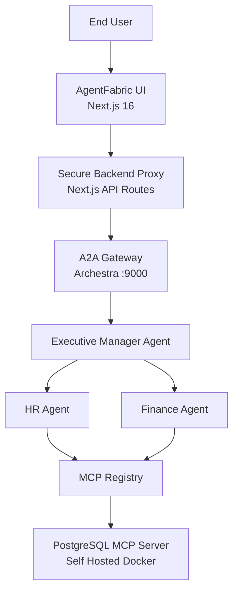
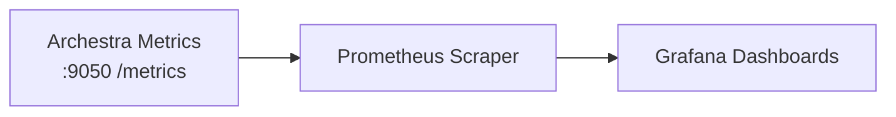

# 🧵 AgentFabric — Enterprise AI Workforce Control Plane

> **Built for the [2 Fast 2 MCP Hackathon](https://www.wemakedevs.org/hackathons/2fast2mcp)**
> Powered by [Archestra.ai](https://www.archestra.ai)

---

# 🚀 What Is AgentFabric?

**AgentFabric is a governed, observable, multi-agent AI workforce platform.**

It simulates a real enterprise where departments operate as intelligent AI agents — securely orchestrated through Archestra and connected to live data via MCP.

This is not a chatbot demo.
This is enterprise AI infrastructure.

---

# 📑 Table of Contents

- [🏗️ Visual Architecture](#️-visual-architecture-mermaid)
- [🏢 AI Workforce Model](#-ai-workforce-model)
- [🔐 Enterprise Governance Capabilities](#-enterprise-governance-capabilities-used)
- [📊 Observability Dashboard](#-production-observability-dashboard)
- [📸 Screenshots](#-screenshots-add-your-images-here)
- [🛠 Tech Stack](#-tech-stack)
- [🚀 Quick Start](#-quick-start)
- [🧵 Final Philosophy](#-final-philosophy)

---

# 🏗️ Visual Architecture

## 🔷 Core System Architecture



---

## 📊 Observability Architecture



---

# 🏢 AI Workforce Model

| Agent                | Responsibility          | Capabilities                    |
| -------------------- | ----------------------- | ------------------------------- |
| 🧠 Executive Manager | Orchestrates sub-agents | Delegation, strategic summaries |
| 👥 HR Agent          | Employee intelligence   | Leave data, org structure       |
| 💰 Finance Agent     | Financial analytics     | Budgets, expenses, payroll      |

Each agent:

* Runs remotely on Archestra
* Uses controlled MCP tools
* Operates under policy enforcement
* Is fully observable via metrics

---

# 🔐 Enterprise Governance Capabilities Used

AgentFabric deeply integrates Archestra’s core platform features:

## ✅ MCP Registry

* Remote MCP services
* Self-hosted PostgreSQL MCP (Docker)
* Fine-grained tool assignment per agent
* Credential isolation per MCP service

## ✅ LLM Configuration

* Centralized model provider management
* No API keys exposed to frontend
* Provider abstraction without code changes

## ✅ Tool Policies

* Context-aware allow/block rules
* Trusted vs untrusted result classification
* Optional dual-LLM sanitization
* Tool execution governance

## ✅ A2A Gateway

* Token-based secure agent communication
* Standardized agent interoperability
* Zero direct LLM calls from client

## ✅ Archestra Platform APIs

* Agent card discovery
* Conversation history retrieval
* Dynamic agent metadata loading

## ✅ Observability

* Token usage metrics
* Cost tracking
* P95 latency
* Time to first token
* Blocked tool counts
* CPU and system health

---

# 📊 Production Observability Dashboard

AgentFabric integrates Prometheus + Grafana to monitor:

* 🔢 Total Tokens Used
* 👤 Tokens Per Agent
* 📥 Input vs Output Split
* 💰 Cost Per Agent
* ⚡ Tokens Per Second
* ⏱ P95 Request Latency
* 🚨 Blocked Tool Attempts

This transforms AI from a black box into a measurable enterprise system.

---


# 📸 Screenshots (Add Your Images Here)

## 🖥️ Workforce Control Plane UI


---

## 💬 Agent Conversation View


---

## 📊 Observability Dashboard


---

## 🔧 MCP Configuration


---

# 🛠 Tech Stack

| Layer         | Technology            |
| ------------- | --------------------- |
| Frontend      | Next.js 16 + React 19 |
| Backend       | Next.js API Routes    |
| Protocol      | A2A + MCP             |
| AI Platform   | Archestra             |
| Database      | PostgreSQL            |
| Observability | Prometheus + Grafana  |
| SDK           | @a2a-js/sdk           |

---

# 🚀 Quick Start

```bash
git clone https://github.com/TheKumaara/AgentFabric.git
cd agentfabric
npm install
```

### Setup Database

```bash
createdb agentfabric
npm run db:push
npm run db:seed
```

### Configure Archestra

```
ARCHESTRA_API_KEY=
ARCHESTRA_A2A_GATEWAY_TOKEN=
ARCHESTRA_BASE_URL=
ORCHESTRATOR_PROMPT_ID=
HR_PROMPT_ID=
FINANCE_PROMPT_ID=
```

```bash
npm run dev
```

---

# 🧵 Final Philosophy

> AgentFabric is not an AI chatbot.
> It is an enterprise AI workforce infrastructure layer.

---

